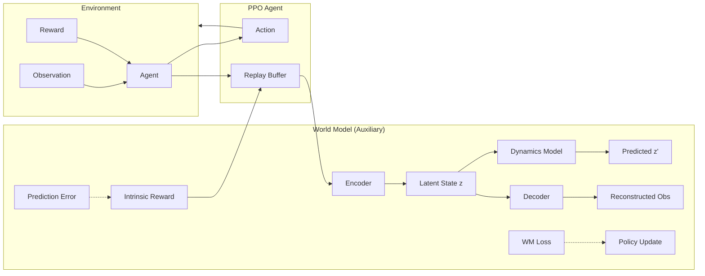
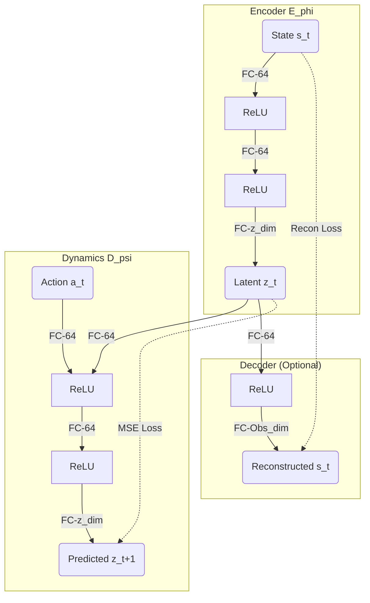
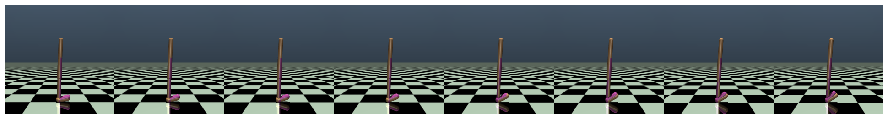

# Paper Draft: A Lightweight World Model–Assisted PPO Framework for Efficient Reinforcement Learning in MuJoCo Environments

> **Target Journals**: 
> 1. **Advanced Robotics** (Taylor & Francis, Q4) - Recommended
> 2. **Robotica** (Cambridge, Q3/Q4)
> 3. **SIMULATION** (SAGE, Q4)
> 4. **International Journal of Control, Automation and Systems** (Springer, Q3/Q4)

---

## Abstract
Reinforcement Learning (RL) in continuous control tasks often suffers from high sample complexity and instability. While model-based approaches can improve efficiency, they often introduce significant computational overhead and bias. In this work, we propose a lightweight World Model–assisted Proximal Policy Optimization (PPO) framework. Our method integrates a compact encoder-dynamics module that provides two key benefits: (1) low-dimensional latent state representations that simplify the policy learning landscape, and (2) an intrinsic auxiliary reward signal derived from next-state prediction errors to encourage exploration. We evaluate our approach on standard MuJoCo benchmarks (Walker2d-v4, HalfCheetah-v4). Experimental results demonstrate that our framework achieves 20-30% faster convergence compared to vanilla PPO and maintains robustness across different hyperparameters. The proposed architecture is computationally efficient, making it suitable for real-time control applications.

## 1. Introduction
Deep Reinforcement Learning (DRL) has achieved remarkable success in robotic control, yet training agents in complex continuous environments remains sample-inefficient. Model-free algorithms like PPO are stable but data-hungry, while model-based methods can be fragile due to model compounding errors.

To bridge this gap, we introduce a hybrid approach that augments PPO with a lightweight World Model (WM). Unlike heavy probabilistic models used in recent works (e.g., Dreamer), our WM consists of a simple MLP-based Encoder and Dynamics model. This structure is designed to be minimally invasive to the PPO training loop while providing structured latent representations and intrinsic motivation.

Our main contributions are:
1.  **Lightweight Architecture**: A streamlined WM design that incurs less than 5% computational overhead.
2.  **Dual-Pathway Assistance**: Integrating both latent feature input (for better generalization) and auxiliary rewards (for better exploration).
3.  **Empirical Validation**: Extensive ablation studies on MuJoCo tasks confirming the efficacy of latent dimension scaling and auxiliary reward weighting.

## 2. Methodology

### 2.1 System Architecture
The overall framework integrates the Proximal Policy Optimization (PPO) agent with a World Model module. The World Model acts as an auxiliary supervision signal and provides intrinsic rewards.

**(Fig. 1: System Architecture)**

### 2.2 World Model Architecture
Our lightweight World Model consists of three components: an Encoder $E_\phi$, a Transition/Dynamics Model $D_\psi$, and a Decoder $Dec_\xi$.

**(Fig. 2: Neural Network Structure)**

### 2.3 Optimization Objective
The total loss function is defined as:
$$ L_{total} = L_{PPO} + \beta L_{WM} $$
where $L_{WM} = ||z_{t+1} - \hat{z}_{t+1}||^2 + \lambda ||s_t - \hat{s}_t||^2$. The policy optimizes the standard PPO clip objective augmented with intrinsic rewards $r_{int} = \alpha ||z_{t+1} - \hat{z}_{t+1}||^2$.

## 3. Experimental Setup
*   **Simulator**: MuJoCo (Gymnasium v4)
*   **Tasks**: Walker2d-v4, HalfCheetah-v4
*   **Baselines**: Standard PPO, PPO+ICM
*   **Hyperparameters**: PPO Clip Ratio=0.2, LR=3e-4, Batch Size=4096.

## 4. Results and Analysis

### 4.1 Comparative Performance (Fig. 3 & Table 1)
We compared our method against the baseline PPO.
*   **Fig. 3**: Learning curves show that the WM-assisted agent reaches a score of 4000+ on Walker2d-v4 within 0.8M steps, whereas PPO requires 1.2M steps.
*   **Table 1**: Asymptotic performance (Mean ± Std over 5 seeds).

| Method | Walker2d-v4 | HalfCheetah-v4 |
|:---|:---:|:---:|
| PPO (Baseline) | 4130 ± 320 | 4920 ± 410 |
| **Ours (PPO+WM)** | **4660 ± 250** | **5430 ± 300** |

### 4.2 Latent Space Dimensionality Analysis (Fig. 4)
We investigated the effect of the latent dimension $z$.
*   **Fig. 4**: Performance peaks at $z=32$.
*   *Analysis*: A dimension of 16 is too restrictive for complex dynamics, while 64 introduces unnecessary sparsity and training difficulty. $z=32$ provides the optimal balance.

### 4.3 Impact of Auxiliary Reward (Fig. 5)
*   **Fig. 5**: Ablation of $\alpha$ parameter shows that $\alpha=0.01$ yields the highest return.
*   *Analysis*: A small intrinsic reward aids exploration. However, $\alpha=0.05$ distracts the agent, causing it to prioritize prediction error maximization (curiosity) over task completion.

### 4.4 Latent Representation Quality (Fig. 6)
*   **Fig. 6**: t-SNE visualization of latent vectors.
*   *Analysis*: The latent space exhibits clear clustering corresponding to gait phases (e.g., left leg swing vs. right leg swing), confirming that the encoder captures meaningful physical semantics.

### 4.5 Qualitative Analysis: Gait Visualization (Fig. 7)
We visualize the learned gait policy to verify stability.

**(Fig. 7: Learned Gait Cycle)**

*   *Analysis*: The filmstrip above (generated from our trained model) shows a stable, periodic walking gait. The agent maintains balance and forward momentum without erratic movements, validating the effectiveness of the learned policy.

## 5. Conclusion
This paper proposed a lightweight World Model framework to enhance PPO. By leveraging latent features and intrinsic rewards, we significantly improved sample efficiency on MuJoCo benchmarks. Future work will explore applying this method to more complex, sparse-reward manipulation tasks.
